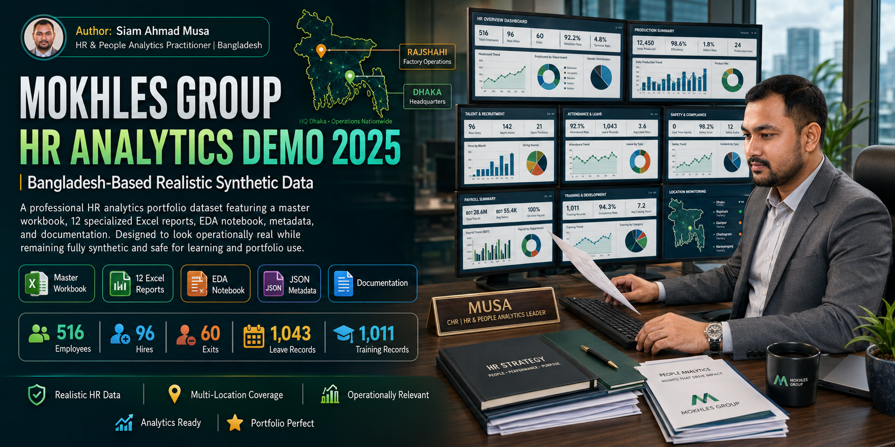

<p align="center">
  
</p>

<h1 align="center">Mokhles Group HR Analytics Demo 2025</h1>

<p align="center">
  A realistic synthetic HR analytics portfolio designed around a Bangladesh business environment.
</p>

<p align="center">
  
  
  
  
  
</p>

## Release v2.1.0

Release **v2.1.0** adds a maintainable, cross-platform Business Intelligence layer for Power BI, Looker Studio, Tableau, Qlik Sense, Excel Power Query/Power Pivot and Metabase.

- **GitHub:** https://github.com/samusa099/mokhles-group-hr-analytics-bd-fy2025
- **Kaggle:** https://www.kaggle.com/datasets/samusahr/mokhles-group-hr-analytics-portfolio-bd-fy2025

## Overview

This repository contains a complete HR analytics portfolio for **Mokhles Group**, a fictional Bangladesh-based organisation. The records are fully synthetic, while the structure, terminology, employee profiles, compensation values and HR transactions were designed to resemble realistic organisational data.

The project combines 13 analysis-ready CSV tables, a consolidated Excel master workbook, 12 specialised Excel reports, a Jupyter Notebook, field-level metadata, automated validation and documented BI implementation paths.

> **Privacy and ethics:** No real employee, applicant, salary, performance, health or confidential organisational data is included.

## Project highlights

| Area | Volume |
|---|---:|
| Employees represented during FY2025 | 516 |
| Year-end headcount | 456 |
| Hires | 96 |
| Employee separations | 60 |
| Leave transactions | 1,043 |
| Training participation records | 1,011 |
| Recruitment requisitions | 110 |
| Performance evaluation records | 456 |
| Health and safety records | 120 |
| Native field descriptions | 186 |

## Business Intelligence compatibility

Supported implementation guides:

- Power BI Desktop
- Looker Studio
- Tableau
- Qlik Sense
- Excel Power Query and Power Pivot
- Metabase

Start here:

```text
docs/bi/00_BI_START_HERE.md
```

Generate the complete 15-table BI-ready layer locally:

```bash
python scripts/build_bi_ready_layer.py
```

The generator creates lowercase `snake_case` dimensions and facts inside `data/bi_ready_csv/`, plus an original-to-BI field mapping. The repository also includes a semantic relationship map, KPI catalogue, dashboard blueprint and Power BI JSON theme.

## Analytics coverage

- Headcount and workforce structure
- Monthly and annual HR KPIs
- Recruitment funnel and time-to-fill
- Employee turnover and retention
- Leave and absence
- Diversity and inclusion
- Learning and development
- Compensation and total reward
- Performance and talent readiness
- Health, safety and corrective actions
- Executive and board-level HR reporting

## Repository structure

```text
mokhles-group-hr-analytics-bd-fy2025/
├── .github/                 Workflows and contribution templates
├── assets/                  Cover and dashboard previews
├── bi_assets/               BI theme and semantic-model assets
├── data/
│   ├── csv/                 13 authoritative analytical CSVs
│   ├── bi_ready_csv/        Generated cross-platform BI layer
│   └── excel/               Master workbook and 12 reports
├── docs/bi/                 Platform-specific BI guides
├── examples/                Python usage example
├── metadata/                Project, GitHub and Kaggle metadata
├── notebooks/               Exploratory Jupyter Notebook
├── scripts/                 Validation and BI generation utilities
└── src/                     Reusable Python data loader
```

## Quick start

```bash
git clone https://github.com/samusa099/mokhles-group-hr-analytics-bd-fy2025.git
cd mokhles-group-hr-analytics-bd-fy2025
python -m pip install -r requirements.txt
python -m pip install -e .
python scripts/validate_repository.py
python scripts/build_bi_ready_layer.py
```

Launch the notebook:

```bash
jupyter lab notebooks/Mokhles_HR_Analytics_EDA.ipynb
```

## Excel portfolio

The `data/excel/` directory includes one consolidated master workbook and 12 specialised reports covering headcount, monthly KPIs, annual reporting, board KPIs, recruitment, turnover, leave, diversity, learning, compensation, performance and health and safety.

## Data dictionary

The complete field-level dictionary is available at:

```text
data/csv/13_Data_Dictionary_FY2025.csv
```

## Validation and quality controls

The repository validates required files, CSV headers, schema alignment, field descriptions, JSON/notebook validity and Excel workbook integrity through a local script and GitHub Actions.

## Author

**Siam Ahmad Musa**  
Human Resources professional and people analytics practitioner from Bangladesh.

## Licences

- **Dataset and documentation:** CC BY 4.0
- **Python utilities and supporting code:** MIT Licence

## Disclaimer

Mokhles Group is a fictional company name. All records are synthetic and must not be presented as real organisational or employee information.
