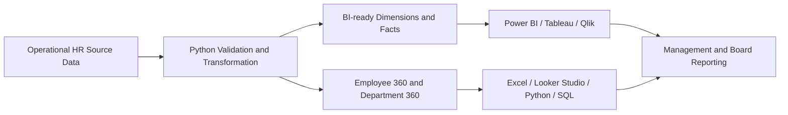

<p align="center">
  
</p>

<h1 align="center">Mokhles Group HR Analytics Demo 2025</h1>

<p align="center">
  <strong>A portfolio-grade, fully synthetic HR and People Analytics ecosystem built for Bangladesh.</strong><br>
  Clean source data, reproducible Python workflows and decision-ready assets for Excel, Power BI, SQL and modern BI platforms.
</p>

<p align="center">
  <a href="https://www.kaggle.com/datasets/samusahr/mokhles-group-hr-analytics-portfolio-bd-fy2025"></a>
  
  
  
  
</p>

<p align="center">
  
  
  
  
</p>

<p align="center">
  <a href="#-overview">Overview</a> ·
  <a href="#-project-snapshot">Snapshot</a> ·
  <a href="#-choose-your-workspace">Workspaces</a> ·
  <a href="#-dataset-usage">Usage</a> ·
  <a href="#-repository-structure">Structure</a> ·
  <a href="#-quick-start">Quick Start</a>
</p>

---

## ✨ Overview

**Mokhles Group HR Analytics Demo 2025** is an end-to-end analytics project for a fictional Bangladesh-based organisation. It demonstrates the complete workflow from operational HR records to data validation, analytical modeling, KPI calculation and executive reporting.

> **Analytics flow:** source data → validation → transformation → BI model → KPI calculation → dashboard and management insight.

| Capability | Included |
|---|---|
| 🏢 **Business realism** | Bangladesh names, locations, BDT compensation values and practical HR terminology |
| 📊 **Analytics coverage** | Workforce, recruitment, turnover, leave, diversity, learning, compensation, performance and safety |
| 🧱 **BI engineering** | Dimensions, fact tables, relationships, Power Query, DAX, theme and dashboard blueprint |
| ✅ **Data quality** | Table profiling, field profiling, duplicate checks and validation rules |
| 🐍 **Reproducibility** | Python scripts, structured metadata and Jupyter analysis |
| 🛡️ **Ethical design** | No real employee, payroll, applicant or confidential organisational information |

---

## 📊 Project snapshot

<table>
<tr>
<td width="25%" align="center"><strong>516</strong><br>Employees represented</td>
<td width="25%" align="center"><strong>456</strong><br>Year-end headcount</td>
<td width="25%" align="center"><strong>15</strong><br>BI-ready tables</td>
<td width="25%" align="center"><strong>803</strong><br>Documented fields</td>
</tr>
</table>

| Activity | Volume |
|---|---:|
| Hires | 96 |
| Employee separations | 60 |
| Leave transactions | 1,043 |
| Training participation records | 1,011 |
| Recruitment requisitions | 110 |
| Performance evaluations | 456 |
| Health and safety records | 120 |

---

## 🧭 Choose your workspace

<table>
<tr>
<td width="50%" valign="top">

### 🧑‍💻 GitHub engineering source

Use the main repository folders when you want to develop, validate or extend the project.

- `data/` — source, BI-ready and analysis-ready data
- `scripts/` — validation and transformation automation
- `notebooks/` — exploratory analysis
- `docs/` — usage, platform and KPI guidance
- `bi_assets/` — semantic model and dashboard assets

</td>
<td width="50%" valign="top">

### 🌐 Kaggle distribution workspace

Use the packaged workspace when you want a clean, numbered and download-friendly learning environment.

- `packages/kaggle/structured_workspace/`
- `packages/kaggle/publish/`

The numbered folders separate source data, clean data, notebooks, documentation, BI assets and scripts—so users do not have to search through unrelated files.

</td>
</tr>
</table>

---

## 🎯 Dataset usage

Use this project to calculate HR KPIs, practise data cleaning, build Excel or Power BI dashboards, write SQL queries, perform Python analysis and develop portfolio or classroom projects.

| Goal | Recommended starting point |
|---|---|
| Quick employee-level analysis | `data/analysis_ready/employee_360_fy2025.csv` |
| Department comparison | `data/analysis_ready/department_360_summary_fy2025.csv` |
| Power BI relational model | `data/bi_ready_csv/` |
| Detailed operational analysis | `data/csv/` |
| Data-quality assessment | `data/data_quality/` |
| Download-friendly Kaggle workspace | `packages/kaggle/structured_workspace/` |

### Common calculations

- 👥 Headcount, growth, hiring rate, turnover and retention
- 🎯 Time-to-fill, offer acceptance and cost per hire
- 🗓️ Leave utilisation and absence indicators
- 🎓 Training completion, score improvement and training ROI
- 💰 Payroll, benefits, salary-band alignment and compa-ratio
- ⭐ Performance, potential and promotion readiness
- 🦺 Incident frequency, severity and corrective-action tracking

📘 **[Open the complete Dataset Usage Guide](docs/DATASET_USAGE_GUIDE.md)** for formulas, worked examples, Excel guidance, DAX, Python, SQL and project ideas.

---

## 🧱 Analytics architecture



| Layer | Purpose | Location |
|---|---|---|
| **Source data** | Authoritative operational-style tables | `data/csv/`, `data/excel/` |
| **BI-ready layer** | Normalised dimensions and facts | `data/bi_ready_csv/` |
| **Analysis-ready layer** | Consolidated Employee 360 and Department 360 | `data/analysis_ready/` |
| **Data quality** | Profiles and validation rules | `data/data_quality/` |
| **BI assets** | Relationships, KPIs, DAX, theme and blueprints | `bi_assets/`, `docs/platforms/` |
| **Kaggle package** | Structured download and learning workspace | `packages/kaggle/` |

---

## 🗂️ Repository structure

```text
mokhles-hr-analytics/
├── .github/                    # Workflows and contribution templates
├── assets/                     # Repository visuals
├── bi_assets/                  # Power BI theme and semantic-model assets
├── data/
│   ├── csv/                    # Original analytical CSV tables
│   ├── excel/                  # Master and specialist workbooks
│   ├── bi_ready_csv/           # Dimensions and fact tables
│   ├── analysis_ready/         # Employee 360 and Department 360
│   └── data_quality/           # Profiles and validation rules
├── docs/
│   ├── DATASET_USAGE_GUIDE.md
│   ├── bi/
│   └── platforms/
├── notebooks/                  # Jupyter analysis
├── packages/
│   └── kaggle/
│       ├── structured_workspace/
│       │   ├── 00_START_HERE/
│       │   ├── 01_SOURCE_DATA/
│       │   ├── 02_CLEAN_DATA/
│       │   ├── 03_POWER_BI/
│       │   ├── 04_EXCEL_ANALYTICS/
│       │   ├── 05_LOOKER_STUDIO/
│       │   ├── 06_TABLEAU/
│       │   ├── 07_QLIK/
│       │   ├── 08_METABASE/
│       │   ├── 09_NOTEBOOKS/
│       │   ├── 10_DOCUMENTATION/
│       │   ├── 11_KAGGLE_METADATA/
│       │   └── 12_SCRIPTS/
│       └── publish/            # Kaggle metadata and cover asset
├── scripts/                    # Build, profile and validation scripts
├── src/                        # Reusable Python package
├── wiki/                       # Repository-maintained Wiki source
├── CITATION.cff
├── CODE_OF_CONDUCT.md
├── CONTRIBUTING.md
├── LICENSE
├── LICENSE-CODE
├── README.md
└── requirements.txt
```

---

## 🚀 Quick start

### 1. Clone and prepare

```bash
git clone https://github.com/samusa099/mokhles-hr-analytics.git
cd mokhles-hr-analytics
python -m venv .venv
```

**Windows PowerShell**

```powershell
.\.venv\Scripts\Activate.ps1
py -m pip install -r requirements.txt
py -m pip install -e .
```

**macOS or Linux**

```bash
source .venv/bin/activate
python -m pip install -r requirements.txt
python -m pip install -e .
```

### 2. Validate and build

```bash
python scripts/validate_repository.py
python scripts/build_bi_ready_layer.py
python scripts/build_analysis_ready.py
python scripts/profile_data.py
```

### 3. Explore

```bash
jupyter lab notebooks/Mokhles_HR_Analytics_EDA.ipynb
```

---

## 📚 Documentation map

- 📘 [Dataset Usage Guide](docs/DATASET_USAGE_GUIDE.md)
- 🟨 [Power BI implementation](docs/platforms/power_bi_assets/)
- 🟩 [Excel analytics](docs/platforms/excel_analytics/)
- 🟦 [Looker Studio](docs/platforms/looker_studio/)
- 🟪 [Tableau, Qlik and Metabase](docs/platforms/)
- 📦 [Kaggle workspace guide](packages/kaggle/README.md)
- 📖 [Project Wiki source](wiki/Home.md)

---

## 👤 Author

**Musa**  
Human Resources Professional and People Analytics Practitioner, Bangladesh.

---

## ⚖️ Licences

- **Dataset and documentation:** CC BY 4.0 — see `LICENSE`
- **Python code and notebook utilities:** MIT — see `LICENSE-CODE`

---

## 🛡️ Data ethics

Mokhles Group is fictional. All employee, applicant, compensation, performance, leave, training and workplace-safety records are synthetic. They must not be presented as real organisational or employee information.
